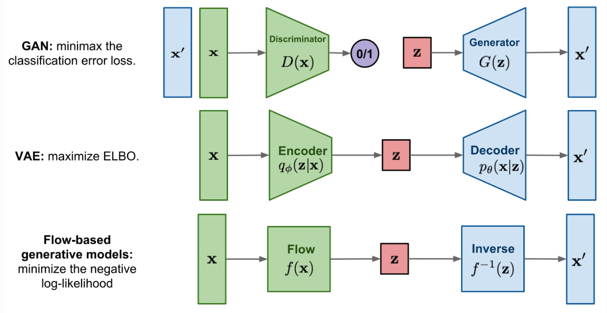
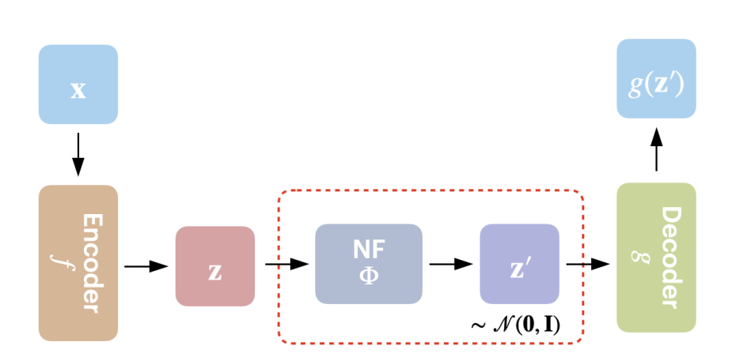
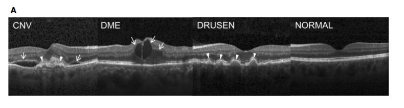
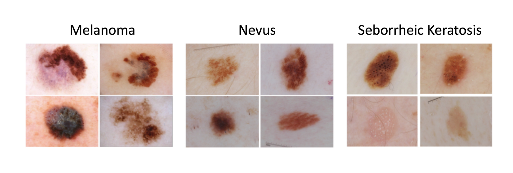
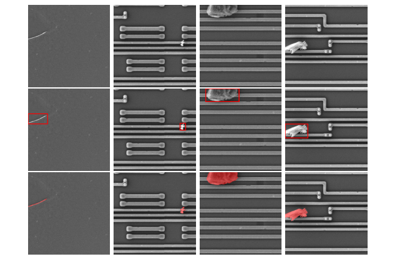
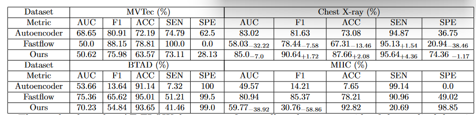

# Study of "AE-FLOW: Autoencoders with Normalizing Flows for Anomaly Detection"

## Paper summary

### Introduction
Anomaly detection (AD), the task of identifying data that deviates from a given distribution, has been an active area of research for several decades [[4]](#works-cited). As a result, a large variety of AD methods have been developed, including statistics-based, distance-based, and clustering-based approaches [[6]](#works-cited). In the past decade, deep learning-based methods have gained prominence and consistently outperformed other approaches. These methods utilize the power of deep learning for feature extraction and representation [[4]](#works-cited). However, a significant challenge in designing successful deep learning-based models lies in the low availability of abnormal images in current datasets. Consequently, these models often rely on learning a normal image distribution to identify anomalous samples [[6]](#works-cited).

Anomaly detection has many useful applications, such as defect detection in industrial environments [[4]](#works-cited) and finding anomalies in medical images such as X-ray scans [[2]](#works-cited). Notable models such as f-anoGAN [[5]](#works-cited) and Fastflow [[3]](#works-cited) have demonstrated impressive results on various datasets, particularly in the industrial domain. However, there is still room for improvement in anomaly detection within the medical domain [[6]](#works-cited).

One promising anomaly detection model is AE-FLOW, introduced in 2023 by [Zhao et al](#works-cited). AE-FLOW combines the strengths of autoencoders and the tractable probability of normalizing flow (NF) methods by integrating a normalizing flow into the autoencoder pipeline [[6]](#works-cited). This integration aims to address the limitations of each individual anomaly detection method. AE-FLOW learns a distribution of normal images and detects anomalies by reconstructing inputs and measuring their similarity to the original image. By utilizing the learned distribution of normal images, AE-FLOW is able to differentiate between normal and anomalous images. Moreover, by training only on normal data, AE-FLOW overcomes the challenge of limited abnormal image availability. 

In their study, [Zhao et al.](#works-cited) evaluated AE-FLOW on various medical datasets and reported promising results. AE-FLOW achieved remarkable performance, with an area under the curve (AUC) of up to 98.15\%, surpassing the performance of the next best model by an improvement of 3.88\%. These results highlight the potential of AE-FLOW as an effective anomaly detection model for medical applications. Given the achievements obtained on medical datasets, we will explore whether these achievements can also be achieved on industrial datasets.

## Background information

### Autoencoders
An autoencoder (AE) [[12]](#works-cited) consists of an encoder that generates a latent representation of the input, and a decoder that reconstructs the input from the latent representation. A reconstructed image can be obtained by encoding and subsequently decoding an input. The reconstructed image fits into the distribution learned by the autoencoder. This means that we can use the AE for anomaly detection by comparing the reconstruction to the original image. This way, we can determine if the original image is out-of-distribution and therefore anomalous.

Autoencoders are often used in Generative Adversarial Networks (GAN) [[11]](#works-cited), a model that consists of a traditional AE and an additional subnetwork known as a discriminator. GANs operate under the assumption that if the AE learns the right features, its decoder can generate outputs that closely resemble samples from the input distribution when provided with randomly generated inputs. While training the AE, a discriminator is simultaneously trained to distinguish between real and fake inputs, which in turn improves AE training. Consequently, the decoder learns to generate more realistic outputs, while the discriminator improves its ability to differentiate between real and generated samples. 

### Normalizing flows
Normalizing flows (NF) [[13]](#works-cited) are a family of likelihood-based anomaly detection models that present an alternative approach to anomaly detection. Likelihood-based models construct a likelihood function that transforms an observed image's features into a versatile distribution, which can then be simplified. This is done by using a sequence of invertible transformations to simplify complex distributions. NF-based methods have been shown to achieve very high performance, especially for anomaly detection in industrial datasets. NF-based methods are limited by the fact that decisions are made based on the estimated likelihood of the extracted features. As a result, any structural information contained within the image is disregarded, meaning potentially crucial information is completely ignored.

###  Notable approaches

f-anoGAN [[5]](#works-cited) and GANomaly [[10]](#works-cited)  are two notable examples of GAN-based anomaly detection methods. AnoGAN utilizes a weighted sum of residual and discrimination scores, while GANomaly measures the distance of inputs in the latent feature space. However, autoencoders, commonly used in anomaly detection, have limited capacity to accurately model high-dimensional data distributions, leading to reconstruction inaccuracies.

FastFlow, proposed by [Yu et al.](#works-cited) in 2021, is an unsupervised anomaly detection and localization method that overcomes the limitations of existing representation-based approaches. It leverages 2D normalizing flows as a probability distribution estimator, making it compatible with various deep feature extractors such as ResNet and vision transformers. During training, FastFlow learns to transform input visual features into a tractable distribution and employs the learned likelihood for anomaly recognition during inference. Notably, FastFlow outperforms previous state-of-the-art methods on the MVTec AD dataset [[9]](#works-cited) in terms of accuracy and inference efficiency, achieving an impressive 99.4\% AUC in anomaly detection. These results highlight FastFlow's ability to capture the relationships between local and global image features, which are crucial for accurate anomaly identification.

### Model Analysis
AE-FLOW combines an autoencoder and a normalizing flow by integrating the NF into the autoencoder pipeline. With this, [Zhao et al.](#works-cited) aim to address the limitations of other anomaly detection methods. 
AE-FLOW learns a distribution of normal images and then detects anomalies by reconstructing the inputs and measuring their similarity to the original image. By learning a distribution of normal images, AE-FLOW can distinguish between normal and anomalous images. By only using normal data for training, AE-FLOW provides a solution to the problem of limited abnormal image data availability.
The architecture of AE-FLOW is pictured below. It resembles a standard autoencoder, however the latent representation of the input _z_ is put through a normalizing flow to produce the normalized representation *z'*. The normalizing flows are trained with normal data to ensure that abnormal features are poorly captured in the learned distribution. This prevents the decoder from effectively reconstructing abnormal features, which enables us to detect anomalies based on the difference between the original, potentially abnormal image and the reconstructed and normalized image.

AE-FLOW is trained using a loss function that accounts for reconstruction accuracy at the pixel level and the distribution likelihood at the feature level. This way, it ensures that the different components are trained to perform well at the intended frame of reference. It utilizes a corresponding anomaly score function comprised of the reconstruction error and the flow likelihood to detect out-of-distribution data. 

The approach proves useful, exhibiting significant improvements with multiple metrics across all tested datasets. It is most consistent with the OCT dataset [[2]](#works-cited), where it outperforms all five tested reconstruction and likelihood-based models across five different metrics, showing percentage increases of up to 40.1 points. 

### Used data-sets
The OCT (Optical Coherence Tomography) dataset by [Kermany et al. (2018)](#works-cited) contains 26,315 normal images that are used for training purposes. During the testing phase, the dataset includes four categories: normal, drusen, CNV, and DME. The three categories drusen, CNV DME are considered abnormal data, with each category consisting of 242 images [[6]](#works-cited).

The X-ray dataset by [Kermany et al.](#works-cited) consists of 1,349 cases with normal chest X-ray images for training. For testing purposes, there are 234 normal images and 390 abnormal images diagnosed as pneumonia.

The ISIC2018 challenge dataset [[3]](#works-cited) for task three was used which contains seven categories. [Lu \& Xu (2018)](#works-cited) have classified the NV (nevus) category as normal samples and the rest category as abnormal data. The training set includes 6705 healthy images and the validation set is used as the test data which contains 123 normal images and 70 abnormal images.

The MIIC dataset introduced by [Huang et al. (2021)](#works-cited) comprises genuine microscopic images of integrated circuits (ICs) and consists of 23,888 normal images used for training purposes, along with 1,272 normal images and 116 abnormal images used for testing [[1]](#works-cited). 

### Strengths and weaknesses

#### Strengths

* AE-FLOW has remarkable performance on medical datasets, something that popular anomaly detection models fail to achieve.
* AE-FLOW is a straightforward integration of other two well-studied AD models, allowing for its inner workings to be more intuitive than if it were completely novel.
* Anomaly maps are easily extracted by taking the residual image, allowing us to interpret and analyze the model's decisions.
* Results on the Microscopic Images of Integrated Circuits (MIIC) dataset are promising, and indicate that AE-FLOW may also be effective at anomaly detection outside of the medical domain.

#### Weaknesses
* AE-FLOW is a newly proposed model, therefore it has limited documentation and research. We cannot determine whether AE-FLOW has reliable or reproducible results based on the paper by [Zhao et al.](#works-cited) alone.
*  AE-FLOW does not provide an indication of uncertainty in its predictions. This can lead to overconfident or misleading predictions, which can have severe repercussions in safety-critical medical applications. For example, high uncertainty predictions could be flagged for human inspection to reduce chances of error.
* AE-FLOW has limited results outside of medicine, preventing us from understanding the scope of its real-world applications. There is not enough information to ascertain if these results are generalizable, or if better performance in the medical domain came at the cost of lowered effectiveness in domains where AE-FLOW's predecessors performed best, such as the industrial domain.

## Research contributions
AE-FLOW's results prove that it is a promising model and an interesting development in anomaly detection. Therefore, we strive to investigate the potential of AE-FLOW, both as is and as a foundation for developing novel methods. We make the following contributions:
* We provide a publicly available PyTorch implementation of AE-FLOW,
* We conduct a reproducibility study of AE-FLOW and certain baselines on multiple datasets,
* We assess the model's generalizability by testing it on the beanTech Anomaly Detection (BTAD) dataset, which consists of industrial images,
* Finally, we make a novel contribution and investigate the potential incorporation of uncertainty quantification into AE-FLOW by developing and testing an AE-FLOW based deep ensemble on the Chest X-ray images dataset.

## Methodology
### Reproducibility study
We reproduce AE-FLOW following the implementation details provided by [Zhao et al.](#works-cited). The AE-FLOW model consists of an encoder, flow module and decoder. The flow module contains two different subnet-architectures; ConvNet-like, and ResNet-like. The flow module is implemented using the Framework for Easily Invertible Architectures (FrEIA) [[8]](#works-cited) Python library. Using FrEIA, we create 8 flow-blocks consisting of either of the aforementioned subnet-architectures, and concatenate them. 

[Zhao et al.](#works-cited) provide some information on the dataset characteristics, however, this information lacks preprocessing information. As we utilize ResNet and ConvNet subnet-architectures, we normalize images using ImageNet values. This includes normalizing it to the standard ImageNet means and standard deviations, applying gray-scale, center cropping, and resizing the images to 256 by 256, as specified by [Zhao et al.](#works-cited).  

The loss function provided by the authors of AE-FLOW caused issues in training the model, as the total loss function consists of a positive loss, obtained from the reconstruction loss, and the flow loss, a negative loss. This led the loss to zero, even when each individual loss is high, as the two losses cancel one another out. To address this, we have implemented the Bits Per Dimension (BPD) loss, and weighted it using the same $\beta$ value as the original authors. 

The AE-FLOW model is trained to output anomaly scores for each image. For the task of binary classification, a threshold therefore has to be used. As the authors do not provide any threshold, or threshold finding method, we have implemented a threshold finding function. This threshold finding function is applied to the validation set during training, and aims to maximize the F1 score of the model being trained. With this implementation, we aim to objectively find a threshold through the validation set. 

### Model generalizability
[Zhao et al.](#works-cited) have presented  results on multiple medical datasets, but have presented limited results outside of the medical domains. We seek to test AE-FLOW with non-medical datasets in order to evaluate the performance of AE-FLOW in a broader context. Specifically, we aim to assess its effectiveness in the industrial domain, where anomaly detection can play a critical role in enhancing quality assurance in the manufacturing process. We do this by training and evaluating the model on the beanTech Anomaly Detection (BTAD) [[4]](#works-cited) and MVTec [[9]](#works-cited) datasets, which consists of real-world industrial images . We expect AE-FLOW to perform well on these datasets, as anomaly detection models have historically had good performance on industrial images. If it performs as well as we expect, then we can conclude that AE-FLOW is more effective in novel domains compared to other methods, while still performing well in more established domains.

### Uncertainty quantification via deep ensembles
Deep ensembling is an uncertainty quantification (UQ) method proposed by [Lakshminarayanan et al. (2017)](#works-cited) that utilises differently-trained ensembles of neural networks, all of which make predictions on the same input. The input is combined using an aggregation function to produce an output and its corresponding uncertainty.
Deep ensembles successfully quantify uncertainty while being computationally less expensive and being easier to implement from an existing pointwise model.

Due to computational limitations, we decided to perform this experiment only on the X-ray dataset, as we can reasonably assume that these results are representative of the other datasets. The ensemble consists of three models that are trained with different seeds. We chose to use three models instead of five, as proposed in the original paper [[7]](#works-cited), due to computational limitations. 

We aggregate the anomaly scores calculated by each model in the ensemble by taking their mean $\mu$ and standard deviation $\sigma$, resulting in a normal distribution $(\mu, \sigma)$. We can utilize $\mu$ as the aggregated anomaly score, which can then be compared to a threshold to get a prediction on the sample. $\sigma$ is used as an indication of uncertainty, as it represents the variance between predictions. We expect that incorrect predictions will generally have much higher uncertainties than correct predictions. 

## Results
### Reproduction

The results show that AE-FLOW does not perform well on datasets outside of the medical domain. On the medical dataset, chest X-ray, we were however able to beat the authors in most metrics, achieving an F1 score of 90.64\%. FastFlow performed significantly worse on the same dataset, achieving an F1 score around 12\% less than AE-FLOW. The FastFlow results documented by [Zhao et al.](#works-cited) are higher in all metrics, except for SEN. The AE performed better than FastFlow, however still was outperformed by AE-FLOW.

For the MIIC dataset, FastFlow significantly outperformed both the AE, and AE-FLOW models. AE-FLOW performed significantly worse on the MIIC dataset compared to the chest X-ray dataset, and performed significantly worse than reported by [Zhao et al.](#works-cited). AE-FLOW only managed to achieve a 30.76\% F1 score, 58.86\% worse than reported by [Zhao et al.](#works-cited). The accuracy was much better however, reaching 92.82\%. Noteworthy are the SEN and SPE metrics. Because of the imbalance between normal and abnormal samples in the datasets used, certain models obtain a very high SEN and very low SPE, or vice-versa. When this is the case, other scores such as the F1 score are brought down.

### Generalizability
The results on the industrial dataset extensions, MVTec and BTAD, show that AE-FLOW is outperformed by the plain autoencoder for MVTec, and outperformed by FastFlow for BTAD in terms of F1 score. Despite obtaining the worst F1 score, AE-FLOW managed to achieve a better accuracy than the autoencoder for the BTAD dataset.

### Deep ensemble
|     | Certain | Uncertain |
|-----|---------|-----------|
| **True** | 198 | 192 |
| **False** | 90 | 144 |

The table above shows the results of the uncertainty quantification, with the rows indicating whether the prediction was correct, and the columns indicating whether the ensemble was uncertain in the prediction ($\sigma > 0.0785$). We expected that false predictions would have high uncertainty, and correct predictions would have low uncertainty. This is not the case, as while 61.5\% of the false predictions were considered uncertain, the model was uncertain in 50.7\% of true predictions. Therefore, the results don't fully conform to our expectations.
## Discussion

### Reproducibility study
We were unable to conduct a complete reproducibility study for computational and time constraints. The discrepancy between [Zhao et al.](#works-cited)'s and our reproduction's results initially suggests that their results are in some way, incorrect. However, a more plausible explanation is that the results are simply unreproducible based on the information provided by [Zhao et al.](#works-cited) There are various reasons for this.
The main reason is that details required for reproduction, such as hyperparameters, architecture-related information, random seeds, and data splits were not mentioned in the original paper. Furthermore, certain implementation details were only briefly mentioned. For example, the encoder is based on the ResnetWide50 implementation. However, the paper by [Zhao et al.](#works-cited) does not mention these cropping transformations, which would be necessary for the encoder to work correctly. Another example is the anomaly score threshold, which is used to determine if a given sample is an anomaly. We tried multiple methods to find this threshold, however we weren't able to find a threshold that provided us with similar results to the ones provided by the authors.

In order to address the data imbalance and small validation set size, we have implemented cross-validation. This led to an increase in performance, however, this was still significantly lower than [Zhao et al.](#works-cited) report. We thought this may have been due to the way in which the F1 score is calculated, which assumes a balanced dataset. We attempted to weigh the F1 score when optimizing thresholds in order to account for this. Unfortunately this only led to worse results.

The loss function described by [Zhao et al.](#works-cited) does not account for the channel dimensions. Furthermore, as the authors use the negative log likelihood, the overall loss becomes a positive value obtained from the reconstruction loss, minus the flow loss. This leads to convergence when both losses are equal. This is undesirable however, as both losses separately may be very high, leading to bad model performance. The authors' explanation of their reasoning behind this loss function is insufficient. Because of this, we have used the BPD (Bits Per Dimension) instead of the negative log likelihood. The BPD loss is added to the flow loss, which has empirically lead to better model performance.

[Zhao et al.](#works-cited) state that all models are trained utilizing a ResNet sub-architecture, except for the chest X-ray dataset, which uses a ConvNet sub-architecture. From our results, it is clear that AE-FLOW performs the best on the chest X-ray dataset. Further investigation is required to explore whether the performance of datasets utilizing the ResNet sub-architecture can be improved by instead utilizing a ConvNet sub-architecture, as the AE-FLOW model yields notable differences in results across these sub-architectures.

The differences between the results obtained in this research and those of [Zhao et al.](#works-cited) are significant. Unfortunately, due to the lack of implementation details shared by the authors, we were unable to reproduce the results of the authors. We have made numerous attempts to reach out to the original authors, however have not received response at the time of writing.

### Model Generalizability
Our results indicate that AE-FLOW performs worse than the baseline, FastFlow implementation, on the BTAD dataset, and as well as the baseline for MVTec. While these results would usually be an indication that AE-FLOW generalizes poorly, this is not the case, as our implementation of AE-FLOW does not replicate the results of the paper by [Zhao et al.](#works-cited) This means that we cannot be certain that we implemented AE-FLOW faithfully, and we cannot reasonably conclude that our results on other datasets are indicative of AE-FLOW's generalizability. Therefore, our results on AE-FLOW's generalizability are inconclusive.

### Deep ensembles
The results from the deep ensemble tests show some potential for an application of deep ensembles to AE-FLOW. Briefly tuning the uncertainty and anomaly thresholds allowed us to somewhat improve our results, however doing so also highlighted challenges of UQ with AE-FLOW.

The anomaly scores produced by the model are not bounded or normalized. As a result, it is difficult to pick an appropriate threshold, and this issue is especially prevalent with the deep ensemble, as the scores and thresholds have to be aggregated in an appropriate manner. The sheer magnitude of one model's score can cause the other two to become trivial in comparison, resulting in predictions biased towards the score with the highest magnitude. Therefore, we believe AE-FLOW scores need to be appropriately normalized for them to work effectively with a deep ensemble.

Furthermore, the hyperparameter tuning indicates that there is much overlap between standard deviations for true and false predictions. This is likely due to the implementation of the deep ensemble, rather than due to the uncertainty in the dataset being unquantifiable. We suggest further research, such as trying other UQ methods, to determine whether the issues we faced are because our deep ensemble is unsuited for this task, or if AE-FLOW's structure is simply a difficult model to integrate with UQ.

## Individual contributions
* **Jan Athmer** - AE-FLOW implementation, debugging, running experiments, writing notebook/blogpost, poster

* **Pim Praat** - AE-FLOW implementation, debugging, extension implementation, running experiments, writing notebook/blogpost, poster

* **Andre de Brandt** - Writing notebook/blogpost, debugging, extension and baseline implementation, running experiments

* **Farrukh Baratov** - Writing notebook/blogpost, debugging, deep ensemble and baseline implementation, author contact attempt

* **Thijs Wijnheijmer** - Writing notebook/blogpost, debugging, poster

## Works cited
[1] Ling Huang, Deruo Cheng, Xulei Yang, Tong Lin, Yiqiong Shi, Kaiyi Yang, Bah Hwee Gwee, and
Bihan Wen. Joint anomaly detection and inpainting for microscopy images via deep self-supervised
learning. In 2021 IEEE International Conference on Image Processing (ICIP), pages 3497–3501,
2021.

[2] Daniel S. Kermany, Michael Goldbaum, Wenjia Cai, Carolina C.S. Valentim, Huiying Liang,
Sally L. Baxter, Alex McKeown, Ge Yang, Xiaokang Wu, Fangbing Yan, Justin Dong, Made K.
Prasadha, Jacqueline Pei, Magdalene Y.L. Ting, Jie Zhu, Christina Li, Sierra Hewett, Jason Dong,
Ian Ziyar, Alexander Shi, Runze Zhang, Lianghong Zheng, Rui Hou, William Shi, Xin Fu, Yaou
Duan, Viet A.N. Huu, Cindy Wen, Edward D. Zhang, Charlotte L. Zhang, Oulan Li, Xiaobo Wang,
Michael A. Singer, Xiaodong Sun, Jie Xu, Ali Tafreshi, M. Anthony Lewis, Huimin Xia, and Kang
Zhang. Identifying medical diagnoses and treatable diseases by image-based deep learning. Cell,
172(5):1122–1131.e9, February 2018.

[3] Yuchen Lu and Peng Xu. Anomaly detection for skin disease images using variational autoencoder,
2018.

[4] Pankaj Mishra, Riccardo Verk, Daniele Fornasier, Claudio Piciarelli, and Gian Luca Foresti. Vt-
adl: A vision transformer network for image anomaly detection and localization. 2021 IEEE 30th
International Symposium on Industrial Electronics (ISIE), pages 01–06, 2021.

[5] Thomas Schlegl, Philipp Seeb ̈ock, Sebastian M. Waldstein, Georg Langs, and Ursula Margarethe
Schmidt-Erfurth. f-anogan: Fast unsupervised anomaly detection with generative adversarial net-
works. Medical Image Analysis, 54:30–44, 2019.

[6] Yuzhong Zhao, Qiaoqiao Ding, and Xiaoqun Zhang. AE-FLOW: Autoencoders with normalizing
flows for medical images anomaly detection. In The Eleventh International Conference on Learning
Representations, 2023.

[7] Balaji Lakshminarayanan, Alexander Pritzel, and Charles Blundell. Simple and scalable predictive
uncertainty estimation using deep ensembles. In I. Guyon, U. Von Luxburg, S. Bengio, H. Wallach,
R. Fergus, S. Vishwanathan, and R. Garnett, editors, Advances in Neural Information Processing
Systems, volume 30. Curran Associates, Inc., 2017.

[8] Lynton Ardizzone, Till Bungert, Felix Draxler, Ullrich K ̈othe, Jakob Kruse, Robert Schmier, and
Peter Sorrenson. Framework for Easily Invertible Architectures (FrEIA), 2018-2022.

[9] Paul Bergmann, Xin Jin, David Sattlegger, and Carsten Steger. The MVTec 3d-AD dataset for
unsupervised 3d anomaly detection and localization. In Proceedings of the 17th International
Joint Conference on Computer Vision, Imaging and Computer Graphics Theory and Applications.
SCITEPRESS - Science and Technology Publications, 2022.

[10] Samet Akcay, Amir Atapour-Abarghouei, and Toby P. Breckon. Ganomaly: Semi-supervised
anomaly detection via adversarial training, 2018.

[11] Ian J. Goodfellow, Jean Pouget-Abadie, Mehdi Mirza, Bing Xu, David Warde-Farley, Sherjil
Ozair, Aaron Courville, and Yoshua Bengio. Generative adversarial networks, 2014.

[12] G. E. Hinton and R. R. Salakhutdinov. Reducing the dimensionality of data with neural networks.
Science, 313(5786):504–507, 2006.

[13] Danilo Jimenez Rezende and Shakir Mohamed. Variational inference with normalizing flows, 2016.